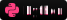
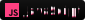
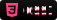

<!-- Header Banner -->
<picture align="center">
    <source media="(prefers-color-scheme: light)" srcset="svg/lightMode/header.svg" />
    
</picture>

  <b>BCS Student @ Farmingdale State • Ronkonkoma, NY</b> 
  <i>Welcome to my GitHub corner of the internet</i>

---

<h2>Education</h2>

<picture>
    <source media="(prefers-color-scheme: light)" srcset="svg/lightMode/education1.svg" />
    
</picture>
    
<picture>
    <source media="(prefers-color-scheme: light)" srcset="svg/lightMode/education2.svg" />
    
</picture>
    
<picture>
    <source media="(prefers-color-scheme: light)" srcset="svg/lightMode/education3.svg" />
     
</picture>
    

---

<h2 style="color:#ff4081;">Tech Stack</h2>

<picture>
    <source media="(prefers-color-scheme: light)" srcset="svg/lightMode/techStack/Java.svg" />
    
</picture>
<picture>
    <source media="(prefers-color-scheme: light)" srcset="svg/lightMode/techStack/Python.svg" />
    
</picture>
<picture>
    <source media="(prefers-color-scheme: light)" srcset="svg/lightMode/techStack/JavaScript.svg" />
    
</picture>
<picture>
    <source media="(prefers-color-scheme: light)" srcset="svg/lightMode/techStack/SQL.svg" />
    
</picture>
<picture>
    <source media="(prefers-color-scheme: light)" srcset="svg/lightMode/techStack/HTML5.svg" />
    
</picture>
<picture>
    <source media="(prefers-color-scheme: light)" srcset="svg/lightMode/techStack/CSS3.svg" />
    
</picture>
<picture>
    <source media="(prefers-color-scheme: light)" srcset="svg/lightMode/techStack/Linux.svg" />
    
</picture>

---

<h2 style="color:#ff4081;">Technical Skills</h2>

<picture>
    <source media="(prefers-color-scheme: light)" srcset="svg/lightMode/skills1.svg" />
    
</picture>

<picture>
    <source media="(prefers-color-scheme: light)" srcset="svg/lightMode/skills2.svg" />
    
</picture>

<picture>
    <source media="(prefers-color-scheme: light)" srcset="svg/lightMode/skills3.svg" />
    
</picture>

---

<h2 style="color:#ff4081;">GitHub Stats</h2>

<picture>
    <source media="(prefers-color-scheme: light)" srcset="svg/lightMode/gitStats1.svg" />
    
</picture>

<picture>
    <source media="(prefers-color-scheme: light)" srcset="svg/lightMode/gitStats2.svg" />
    
</picture>

---

<h2 style="color:#ff4081;">Connect with Me</h2>

<a href="mailto:ryan.cuccu@gmail.com">
        <picture>
            <source media="(prefers-color-scheme: light)" srcset="svg/lightMode/GMAIL.svg" />
            
        </picture>
    </a>

<a href="https://www.linkedin.com/in/ryan-cuccurullo-48b242261/">
        <picture>
            <source media="(prefers-color-scheme: light)" srcset="svg/lightMode/LINKEDIN.svg" />
            
        </picture>
    </a>

<a href="https://github.com/ryguy0601">
        <picture>
            <source media="(prefers-color-scheme: light)" srcset="svg/lightMode/GITHUB.svg" />
            
        </picture>
    </a>

---

