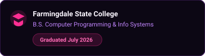
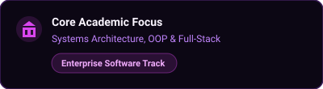
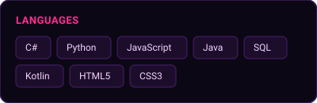
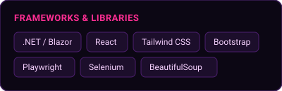
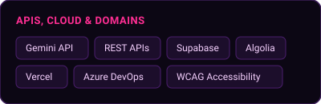

  <!-- Header Banner -->
  <picture>
    <source media="(prefers-color-scheme: dark)" srcset="svg/darkMode/header.svg">
    <source media="(prefers-color-scheme: light)" srcset="svg/lightMode/header.svg">
    
  </picture>

  <h1>Ryan Cuccurullo</h1>
  
<strong>Software Engineer &bull; Full-Stack Development &bull; Automation & AI</strong>

  

    <a href="mailto:ryan.cuccu@gmail.com">
      <picture>
        <source media="(prefers-color-scheme: dark)" srcset="svg/darkMode/GMAIL.svg">
        <source media="(prefers-color-scheme: light)" srcset="svg/lightMode/GMAIL.svg">
        
      </picture>
    </a>
    &nbsp;
    <a href="https://www.linkedin.com/in/ryan-cuccurullo-48b242261/" target="_blank">
      <picture>
        <source media="(prefers-color-scheme: dark)" srcset="svg/darkMode/LINKEDIN.svg">
        <source media="(prefers-color-scheme: light)" srcset="svg/lightMode/LINKEDIN.svg">
        
      </picture>
    </a>
    &nbsp;
    <a href="https://github.com/ryguy0601">
      <picture>
        <source media="(prefers-color-scheme: dark)" srcset="svg/darkMode/GITHUB.svg">
        <source media="(prefers-color-scheme: light)" srcset="svg/lightMode/GITHUB.svg">
        
      </picture>
    </a>
  

  <!-- Education Badges -->
  

    <picture>
      <source media="(prefers-color-scheme: light)" srcset="svg/lightMode/education1.svg" />
      
    </picture>
    <picture>
      <source media="(prefers-color-scheme: light)" srcset="svg/lightMode/education2.svg" />
      
    </picture>
    <picture>
      <source media="(prefers-color-scheme: light)" srcset="svg/lightMode/education3.svg" />
      
    </picture>
  

---

### About Me

Software Engineer and Computer Programming graduate from Farmingdale State College with enterprise experience building web applications, automation platforms, AI-powered solutions, and developer tools. Full-stack development experience across **C#**, **.NET/Blazor**, **Python**, **JavaScript**, **React**, **SQL**, APIs, testing, accessibility, performance, and Agile delivery. Known for turning complex operational and compliance requirements into scalable, maintainable software.

* **Currently:** Web Development Intern — Extended Post-Graduation at American Regent (Architecting .NET Blazor health monitoring dashboard, custom Python operational platforms, VB to .NET migration, and PageSpeed/Algolia REST API integrations)
* **Education:** B.S. in Computer Programming & Information Systems, Farmingdale State College (Graduated July 2026)
* **Achievements:** 1st Place Hackathon Winner for **CORPO** (AI Corporate Translator)
* **Focus Areas:** Full-Stack Development, Automation, AI Applications, API Integration, Visual Regression Testing, WCAG Accessibility, Performance Optimization

---

### Professional Experience

#### **American Regent** — *Web Development Intern (Extended Post-Graduation)*
*May 2026 – Present*
* Architected an internal .NET Blazor web health dashboard centralizing monitoring of SSL/TLS certificates, broken links, and JavaScript vulnerabilities across enterprise web properties.
* Consolidated custom Python monitoring and automation scripts into a unified operational platform, improving visibility into enterprise web health and security.
* Modernized a legacy security registry application by migrating Visual Basic functionality to .NET, improving maintainability, stability, and security compliance.
* Integrated Google PageSpeed Insights and Algolia REST APIs to centralize performance analytics and enterprise intranet search.
* Audited and remediated web accessibility and usability issues across corporate digital properties to support WCAG compliance and improved user experience.

#### **American Regent** — *Web Development Intern*
*May 2025 – August 2025*
* Engineered a multi-threaded Python/Selenium automation platform that captured dynamic website viewports and generated compliance-ready PDF packages for FDA regulatory submissions.
* Remediated 70+ web accessibility issues identified through Level Access testing on the corporate Careers portal, contributing to a 100% Google Lighthouse accessibility score.
* Enhanced the corporate intranet by resolving UI/content issues through ServiceNow and implementing cookie-consent functionality across 7 corporate websites.
* Developed and deployed a JavaScript image-optimization utility that converted and compressed web assets into modern formats, improving website performance.
* Worked in an Agile Scrum environment with cross-functional stakeholders to prioritize, develop, test, and deploy web solutions.

---

### Featured Projects

* **[CORPO — AI Corporate Translator](https://github.com/ryguy0601)**  
  *1st Place Hackathon Winner* &bull; `React` `Python` `Gemini API` `Supabase` `Vercel`  
  Full-stack AI application translating complex contracts and leases into plain language while generating executive summaries and risk analysis. Integrated Gemini API with React and Python services, implemented Supabase persistence, and deployed the production application on Vercel.

* **[Visual Regression Diff Studio](https://github.com/ryguy0601)**  
  *Automated Testing Engine* &bull; `Python` `Playwright` `Tkinter` `Pillow` `Pixelmatch` `BeautifulSoup` `JavaScript`  
  Desktop visual QA suite and headless testing engine for pixel-level visual regression testing between staging and production environments. Built automated route crawling and responsive viewport capture with Playwright, including cookie/popup dismissal and CSS animation suppression. Implemented a Longest Common Subsequence dynamic-programming algorithm to align shifting DOM elements and reduce false positives, generating interactive HTML comparison reports with synchronized scrolling.

* **[Website-to-PDF Automation Suite](https://github.com/ryguy0601)**  
  *Regulatory Pipeline* &bull; `Python` `Selenium` `HTML` `C#`  
  Enterprise automation platform for capturing dynamic web applications and generating full-page PDF documentation for regulatory reporting. Implemented viewport emulation, screenshot stitching, dynamic-content handling, popup management, and multi-threaded concurrent website scans.

---

### Technical Skills

| Category | Technologies & Tools |
| :--- | :--- |
| **Languages** | C#, Python, Java, JavaScript, SQL, Kotlin, HTML5, CSS3 |
| **Frameworks & Libraries** | .NET, Blazor, React, Tailwind CSS, Bootstrap, Selenium, Playwright, BeautifulSoup |
| **APIs & Platforms** | REST APIs, Gemini API, Supabase, Algolia, Google PageSpeed Insights, Vercel |
| **Tools & Environments** | Git, GitHub, Azure DevOps, ServiceNow, Linux, Windows |
| **Specialized Focus** | Full-Stack Development, Automation, AI Applications, API Integration, Visual Regression Testing, WCAG Accessibility, Performance Optimization |

  <picture>
    <source media="(prefers-color-scheme: light)" srcset="svg/lightMode/skills1.svg" />
    
  </picture>
  <picture>
    <source media="(prefers-color-scheme: light)" srcset="svg/lightMode/skills2.svg" />
    
  </picture>
  <picture>
    <source media="(prefers-color-scheme: light)" srcset="svg/lightMode/skills3.svg" />
    
  </picture>

---

### GitHub Activity

  <picture>
    <source media="(prefers-color-scheme: dark)" srcset="svg/darkMode/gitStats1.svg">
    <source media="(prefers-color-scheme: light)" srcset="svg/lightMode/gitStats1.svg">
    
  </picture>
  <picture>
    <source media="(prefers-color-scheme: dark)" srcset="svg/darkMode/gitStats2.svg">
    <source media="(prefers-color-scheme: light)" srcset="svg/lightMode/gitStats2.svg">
    
  </picture>

