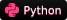
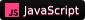
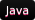
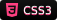

  <!-- Header Banner -->
  <picture>
    <source media="(prefers-color-scheme: dark)" srcset="svg/darkMode/header.svg">
    <source media="(prefers-color-scheme: light)" srcset="svg/lightMode/header.svg">
    
  </picture>

  <h1>Ryan Cuccurullo</h1>
  
<strong>Software Engineer &bull; Full-Stack Development &bull; Automation & AI</strong>

  

    <a href="mailto:ryan.cuccu@gmail.com">
      <picture>
        <source media="(prefers-color-scheme: dark)" srcset="svg/darkMode/GMAIL.svg">
        <source media="(prefers-color-scheme: light)" srcset="svg/lightMode/GMAIL.svg">
        
      </picture>
    </a>
    &nbsp;
    <a href="https://www.linkedin.com/in/ryan-cuccurullo-48b242261/" target="_blank">
      <picture>
        <source media="(prefers-color-scheme: dark)" srcset="svg/darkMode/LINKEDIN.svg">
        <source media="(prefers-color-scheme: light)" srcset="svg/lightMode/LINKEDIN.svg">
        
      </picture>
    </a>
    &nbsp;
    <a href="https://github.com/ryguy0601">
      <picture>
        <source media="(prefers-color-scheme: dark)" srcset="svg/darkMode/GITHUB.svg">
        <source media="(prefers-color-scheme: light)" srcset="svg/lightMode/GITHUB.svg">
        
      </picture>
    </a>
  

---

### 👨‍💻 About Me

Software Engineer and Computer Programming graduate from Farmingdale State College with enterprise experience building web applications, automation platforms, AI-powered solutions, and developer tools. Skilled across **C#**, **.NET/Blazor**, **Python**, **JavaScript**, **React**, and **SQL**, with an emphasis on turning complex operational and compliance requirements into scalable software.

- 🏢 **Currently:** Web Development at American Regent (Centralized monitoring platforms, .NET modernization, REST APIs, & web accessibility)
- 🎓 **Education:** B.S. in Computer Programming & Information Systems, Farmingdale State College (Graduated July 2026)
- 🏆 **Achievements:** 1st Place Hackathon Winner for **CORPO** (AI Corporate Translator)
- ⚡ **Focus Areas:** Full-Stack Web Development, Headless Automation & Testing, WCAG 2.1 Accessibility, AI Integrations

---

### 🛠 Tech Stack

  <!-- Core Existing Repo Tech Badges -->
  <picture>
    <source media="(prefers-color-scheme: dark)" srcset="svg/darkMode/techStack/Python.svg">
    <source media="(prefers-color-scheme: light)" srcset="svg/lightMode/techStack/Python.svg">
    
  </picture>
  <picture>
    <source media="(prefers-color-scheme: dark)" srcset="svg/darkMode/techStack/JavaScript.svg">
    <source media="(prefers-color-scheme: light)" srcset="svg/lightMode/techStack/JavaScript.svg">
    
  </picture>
  <picture>
    <source media="(prefers-color-scheme: dark)" srcset="svg/darkMode/techStack/Java.svg">
    <source media="(prefers-color-scheme: light)" srcset="svg/lightMode/techStack/Java.svg">
    
  </picture>
  <picture>
    <source media="(prefers-color-scheme: dark)" srcset="svg/darkMode/techStack/SQL.svg">
    <source media="(prefers-color-scheme: light)" srcset="svg/lightMode/techStack/SQL.svg">
    
  </picture>
  <picture>
    <source media="(prefers-color-scheme: dark)" srcset="svg/darkMode/techStack/HTML5.svg">
    <source media="(prefers-color-scheme: light)" srcset="svg/lightMode/techStack/HTML5.svg">
    
  </picture>
  <picture>
    <source media="(prefers-color-scheme: dark)" srcset="svg/darkMode/techStack/CSS3.svg">
    <source media="(prefers-color-scheme: light)" srcset="svg/lightMode/techStack/CSS3.svg">
    
  </picture>
  <picture>
    <source media="(prefers-color-scheme: dark)" srcset="svg/darkMode/techStack/Linux.svg">
    <source media="(prefers-color-scheme: light)" srcset="svg/lightMode/techStack/Linux.svg">
    
  </picture>

 

| Category | Technologies & Tools |
| :--- | :--- |
| **Languages** | C#, Python, JavaScript, Java, SQL, Kotlin, HTML5, CSS3 |
| **Frameworks & Libs** | .NET, Blazor, React, Tailwind CSS, Bootstrap, Selenium, Playwright, BeautifulSoup |
| **Platforms & APIs** | Gemini API, REST APIs, Supabase, Algolia, Google PageSpeed Insights, Vercel |
| **Developer Tools** | Git, GitHub, Azure DevOps, ServiceNow, Linux, Windows |

---

### 🚀 Featured Projects

* **[CORPO — AI Corporate Translator](https://github.com/ryguy0601)**  
  *1st Place Hackathon Winner* &bull; `React` `Python` `Gemini API` `Supabase` `Vercel`  
  Full-stack AI web platform translating complex legal contracts and commercial leases into plain language, producing structured executive summaries and risk mitigation analyses.

* **[Visual Regression Diff Studio](https://github.com/ryguy0601)**  
  *Automated Testing Engine* &bull; `Python` `Playwright` `Pixelmatch` `Tkinter` `BeautifulSoup`  
  Desktop visual QA suite that executes route crawling, responsive viewport capture, and dynamic DOM alignment using a Longest Common Subsequence algorithm to generate interactive diff reports.

* **[Website-to-PDF Automation Suite](https://github.com/ryguy0601)**  
  *Regulatory Pipeline* &bull; `Python` `Selenium` `C#` `HTML`  
  Multi-threaded enterprise capture suite providing viewport emulation, dynamic DOM screenshot stitching, and compliance-ready PDF compilation for regulatory submissions.

---

### 📊 GitHub Activity

  <picture>
    <source media="(prefers-color-scheme: dark)" srcset="svg/darkMode/gitStats1.svg">
    <source media="(prefers-color-scheme: light)" srcset="svg/lightMode/gitStats1.svg">
    
  </picture>
  <picture>
    <source media="(prefers-color-scheme: dark)" srcset="svg/darkMode/gitStats2.svg">
    <source media="(prefers-color-scheme: light)" srcset="svg/lightMode/gitStats2.svg">
    
  </picture>

