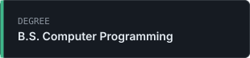
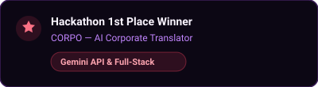
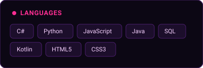
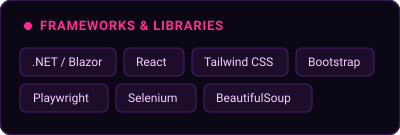
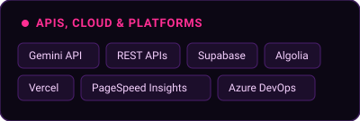
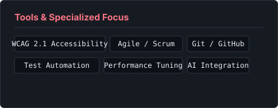

  <!-- Header Banner -->
  

  <h1>Ryan Cuccurullo</h1>
  
<strong>Software Engineer &bull; Full-Stack Development &bull; Automation & AI</strong>

  

    
    &nbsp;
    
    &nbsp;
    
  

  <!-- Education Cards -->
  

    
    
    
  

---

## 👨‍💻 About Me

Software Engineer and Computer Programming graduate from Farmingdale State College with enterprise experience building web applications, automation platforms, AI-powered solutions, and developer tools. Full-stack development experience across **C#**, **.NET/Blazor**, **Python**, **JavaScript**, **React**, **SQL**, APIs, testing, accessibility, performance, and Agile delivery. Known for turning complex operational and compliance requirements into scalable, maintainable software.

* 💼 **Currently:** Web Development Intern (Extended Post-Graduation) at **American Regent** &bull; Architecting .NET Blazor monitoring platforms, legacy VB migrations, and REST API integrations
* 🎓 **Education:** B.S. in Computer Programming & Information Systems, Farmingdale State College (Graduated July 2026)
* 🏆 **Achievements:** 1st Place Hackathon Winner for **CORPO** (AI Corporate Translator)
* 🎯 **Focus Areas:** Full-Stack Web Development, Headless Automation & Testing, WCAG 2.1 Accessibility, AI Integrations

---

## 💼 Work Experience

### **American Regent** &mdash; *Web Development Intern (Extended Post-Graduation)*
`May 2026 – Present`
* Architected an internal **.NET Blazor** web health dashboard centralizing monitoring of SSL/TLS certificates, broken links, and JavaScript vulnerabilities across enterprise web properties.
* Consolidated custom **Python** monitoring and automation scripts into a unified operational platform, improving visibility into enterprise web health and security.
* Modernized a legacy security registry application by migrating Visual Basic functionality to **.NET**, improving maintainability, stability, and security compliance.
* Integrated **Google PageSpeed Insights** and **Algolia REST APIs** to centralize performance analytics and enterprise intranet search.
* Audited and remediated web accessibility and usability issues across corporate digital properties to support **WCAG compliance** and improved user experience.

### **American Regent** &mdash; *Web Development Intern*
`May 2025 – August 2025`
* Engineered a multi-threaded **Python / Selenium** automation platform that captured dynamic website viewports and generated compliance-ready PDF packages for FDA regulatory submissions.
* Remediated 70+ web accessibility issues identified through Level Access testing on the corporate Careers portal, achieving a **100% Google Lighthouse accessibility score**.
* Enhanced the corporate intranet by resolving UI/content issues through **ServiceNow** and implementing cookie-consent functionality across 7 corporate websites.
* Developed and deployed a **JavaScript** image-optimization utility that converted and compressed web assets into modern formats, improving website performance.
* Worked in an **Agile Scrum** environment with cross-functional stakeholders to prioritize, develop, test, and deploy web solutions.

---

## 🚀 Featured Projects

### 📄 **[CORPO — AI Corporate Translator](https://github.com/ryguy0601)**
> **1st Place Hackathon Winner** &bull; `React` `Python` `Gemini API` `Supabase` `Vercel`
* Built a full-stack AI web application translating complex contracts, commercial leases, and financial agreements into plain language while generating executive summaries and risk analysis.
* Integrated the Gemini API with React and Python services; implemented Supabase persistence and deployed the production application on Vercel.

### 🔍 **[Visual Regression Diff Studio](https://github.com/ryguy0601)**
> **Automated Testing Engine** &bull; `Python` `Playwright` `Tkinter` `Pillow` `Pixelmatch` `BeautifulSoup` `JavaScript`
* Developed a desktop application and headless testing engine for pixel-level visual regression testing between staging and production environments.
* Built automated route crawling and responsive viewport capture with Playwright, including cookie/popup dismissal and CSS animation suppression.
* Implemented a Longest Common Subsequence dynamic-programming algorithm to align shifting DOM elements and reduce false-positive visual differences.
* Generated interactive HTML comparison reports with synchronized scrolling and flicker-comparison capabilities.

### 📑 **[Website-to-PDF Automation Suite](https://github.com/ryguy0601)**
> **Enterprise Regulatory Pipeline** &bull; `Python` `Selenium` `HTML` `C#`
* Developed an enterprise automation platform for capturing dynamic web applications and generating full-page PDF documentation for regulatory reporting.
* Implemented viewport emulation, screenshot stitching, dynamic-content handling, popup management, and multi-threaded concurrent website scans.

---

## 🛠️ Technical Skills

  
  
    
  
  

---

## 📊 GitHub Analytics

  
  

